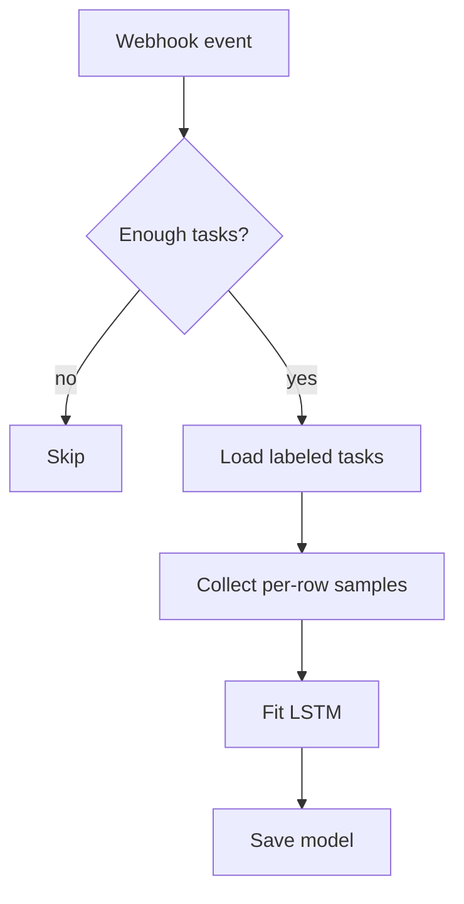
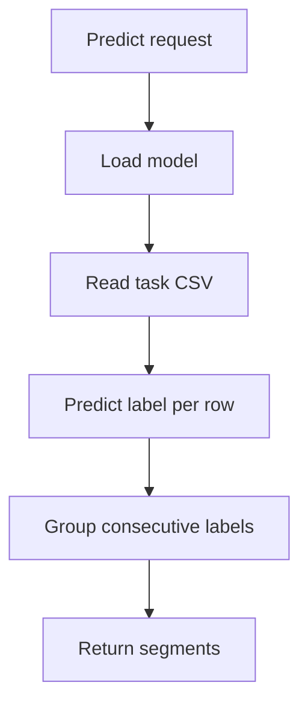

# Time Series Segmenter for Label Studio

This example demonstrates a minimal ML backend that performs time series segmentation.
It trains a small LSTM neural network on labeled CSV data and predicts segments
for new tasks. The backend expects the labeling configuration to use
`<TimeSeries>` and `<TimeSeriesLabels>` tags.

## Before you begin

1. Install the [Label Studio ML backend](https://github.com/HumanSignal/label-studio-ml-backend?tab=readme-ov-file#quickstart).
2. Set `LABEL_STUDIO_HOST` and `LABEL_STUDIO_API_KEY` in `docker-compose.yml`
   so the backend can download labeled tasks for training.

## Quick start

```bash
# build and run
docker-compose up --build
```

A small example CSV is available in `tests/time_series.csv`.

Connect the model from the **Model** page in your project settings. The default
URL is `http://localhost:9090`.

## Labeling configuration

Use a configuration similar to the following:

```xml
<View>
  <TimeSeriesLabels name="label" toName="ts">
    <Label value="Run"/>
    <Label value="Walk"/>
  </TimeSeriesLabels>
  <TimeSeries name="ts" valueType="url" value="$csv_url" timeColumn="time">
    <Channel column="sensorone" />
    <Channel column="sensortwo" />
  </TimeSeries>
</View>
```

The backend reads the time column and channels to build feature vectors. Each
CSV referenced by `csv_url` must contain the time column and the channel
columns.

## Training

Training starts automatically when annotations are created or updated. The model
collects all labeled segments, extracts sensor values inside each segment and
fits an LSTM classifier. Model artifacts are stored in the
`MODEL_DIR` (defaults to the current directory).

Steps performed by `fit()`:

1. Fetch all labeled tasks from Label Studio.
2. Convert labeled ranges to per-row training samples.
3. Fit a small LSTM network.
4. Save the trained model to disk.

## Prediction

For each task, the backend loads the CSV, applies the trained classifier to each
row and groups consecutive predictions into labeled segments. Prediction scores
are averaged per segment and returned to Label Studio.

The `predict()` method:

1. Loads the stored model.
2. Reads the task CSV and builds a feature matrix.
3. Predicts a label for each row.
4. Merges consecutive rows with the same label into a segment.
5. Returns the segments in Label Studio JSON format.

## How it works

### Training pipeline



### Prediction pipeline



## Customize

Edit `docker-compose.yml` to set environment variables such as `LABEL_STUDIO_HOST`
or `MODEL_DIR`. You can also adjust `START_TRAINING_EACH_N_UPDATES` to control
how often training runs.