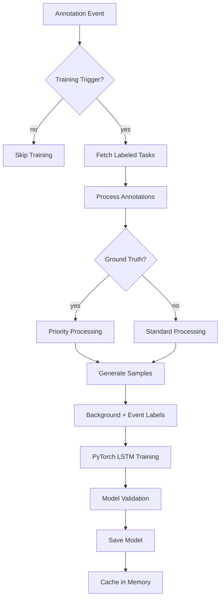
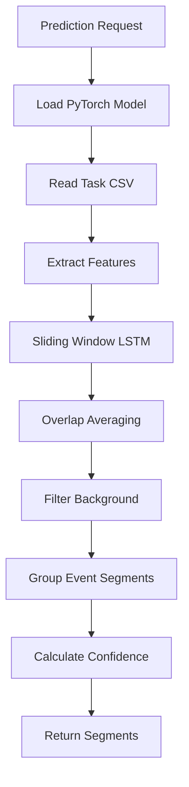

# Time Series Segmenter for Label Studio

https://github.com/user-attachments/assets/9f6a7ebb-bf3e-42d5-bde9-087719494f2d

This example demonstrates a minimal ML backend that performs time series segmentation.
It trains a small LSTM neural network on labeled CSV data and predicts segments
for new tasks. The backend expects the labeling configuration to use
`<TimeSeries>` and `<TimeSeriesLabels>` tags.

## Before you begin

1. Install the [Label Studio ML backend](https://github.com/HumanSignal/label-studio-ml-backend?tab=readme-ov-file#quickstart).
2. Set `LABEL_STUDIO_HOST` and `LABEL_STUDIO_API_KEY` in `docker-compose.yml`
   so the backend can download labeled tasks for training.

## Quick start

```bash
# build and run
docker-compose up --build
```

A small example CSV is available in `tests/time_series.csv`.

Connect the model from the **Model** page in your project settings. The default
URL is `http://localhost:9090`.

## Labeling configuration

Use a configuration similar to the following:

```xml
<View>
  <TimeSeriesLabels name="label" toName="ts">
    <Label value="Run"/>
    <Label value="Walk"/>
  </TimeSeriesLabels>
  <TimeSeries name="ts" valueType="url" value="$csv_url">
    <Channel column="value" />
  </TimeSeries>
</View>
```

The backend reads the time column and channels to build feature vectors. Each
CSV referenced by `csv_url` must contain the time column and the channel
columns.

You can use [the following data](https://raw.githubusercontent.com/HumanSignal/label-studio-ml-backend/refs/heads/master/label_studio_ml/examples/timeseries_segmenter/tests/test_from_video_tutorial.csv) for tests with this labeling configuration.

## Annotation Types

The backend supports two types of the time series segmentation:

**Range Annotations**
- **Use case**: Events that have duration (e.g., "Running from 10s to 30s")
- **Created by**: Dragging across time series to select a time range
- **Behavior**: `start` ≠ `end`, `instant` = `false`

**Instant Annotations**
- **Use case**: Point events or moments in time (e.g., "Fall detected at 15s")
- **Created by**: Double-clicking on a specific point in the time series
- **Behavior**: `start` = `end`, `instant` = `true`

**Note**: Instant labels often create highly imbalanced datasets since they represent brief moments within long time series. The model's **balanced learning approach** is specifically designed to handle this challenge effectively.

## Training

Training starts automatically when annotations are created or updated. The model uses a PyTorch-based LSTM neural network with proper temporal modeling and **balanced learning** to handle imbalanced time series data effectively.

### Training Process

The model follows these steps during training:

1. **Data Collection**: Fetches all labeled tasks from your Label Studio project
2. **Sample Generation**: Converts labeled time ranges into training samples:
   - **Background Class**: Unlabeled time periods are treated as "background" (class 0)
   - **Event Classes**: Your labeled segments (e.g., "Run", "Walk") become classes 1, 2, etc.
   - **Ground Truth Priority**: If multiple annotations exist for a task, ground truth annotations take precedence
3. **Balanced Model Training**: Fits a multi-layer LSTM network with:
   - **Class-weighted loss function** to handle imbalanced data (important for instant labels)
   - **Balanced accuracy monitoring** instead of regular accuracy
   - **Per-class F1 score tracking** to ensure all classes learn properly
   - Configurable sequence windows (default: 50 timesteps)  
   - Dropout regularization for better generalization
   - Background class support for realistic time series modeling
4. **Model Persistence**: Saves trained model artifacts to `MODEL_DIR`

### Training Configuration

You can customize training behavior with these environment variables:

**Basic Configuration:**
- `START_TRAINING_EACH_N_UPDATES`: How often to retrain (default: 1, trains on every annotation)
- `TRAIN_EPOCHS`: Number of training epochs (default: 1000)
- `SEQUENCE_SIZE`: Sliding window size for temporal context (default: 50)
- `HIDDEN_SIZE`: LSTM hidden layer size (default: 64)

**Balanced Learning (for Imbalanced Data):**
- `BALANCED_ACCURACY_THRESHOLD`: Stop training when balanced accuracy exceeds this (default: 0.85)
- `MIN_CLASS_F1_THRESHOLD`: Stop training when minimum per-class F1 exceeds this (default: 0.70)
- `USE_CLASS_WEIGHTS`: Enable class-weighted loss function (default: true)

The balanced learning approach is **especially important when using instant labels** (created by double-clicking on the time series), as these often create highly imbalanced datasets where background periods vastly outnumber event instances.

### Handling Imbalanced Data

Time series data is often highly imbalanced, especially when using instant labels:

**The Problem:**
- Background periods typically constitute 90%+ of the data
- Event instances (Run, Walk, etc.) are rare and brief
- Standard training approaches achieve high accuracy by simply predicting "background" everywhere
- Models fail to learn actual event patterns

**Our Solution:**
```
Class Weights: Automatically calculated inverse frequency weights
├── Background (Class 0): Low weight (e.g., 0.1x)
├── Run (Class 1): High weight (e.g., 5.0x) 
└── Walk (Class 2): High weight (e.g., 4.0x)

Early Stopping: Dual criteria prevent premature stopping
├── Balanced Accuracy ≥ 85% (macro-averaged across classes)
└── Minimum Class F1 ≥ 70% (worst-performing class must be decent)

Metrics: Focus on per-class performance
├── Balanced Accuracy: Equal weight to each class
├── Macro F1: Average F1 across all classes  
└── Per-class F1: Individual class performance tracking
```

This ensures the model learns to detect actual events rather than just predicting background.

### Ground Truth Handling

When multiple annotations exist for the same task, the model prioritizes ground truth annotations:
- Non-ground truth annotations are processed first
- Ground truth annotations override previous labels and stop processing for that task
- This ensures the highest quality labels are used for training

## Prediction

The model processes new time series data by applying the trained LSTM classifier with sliding window temporal context. Only meaningful event segments are returned to Label Studio, filtering out background periods automatically.

### Prediction Process

For each task, the model performs these steps:

1. **Model Loading**: Loads the trained PyTorch model from disk
2. **Data Processing**: Reads the task CSV and creates feature vectors from sensor channels
3. **Temporal Prediction**: Applies LSTM with sliding windows for temporal context:
   - Uses overlapping windows with 50% overlap for smoother predictions
   - Averages predictions across overlapping windows
   - Maintains temporal dependencies between timesteps
4. **Segment Extraction**: Groups consecutive predictions into meaningful segments:
   - **Background Filtering**: Automatically filters out background (unlabeled) periods
   - **Event Segmentation**: Only returns segments with actual event labels
   - **Instant Detection**: Automatically sets `instant=true` for point events (start=end, one sample events that you can label using double click) and `instant=false` for ranges
   - **Score Calculation**: Averages prediction confidence per segment
5. **Result Formatting**: Returns segments in Label Studio JSON format with proper instant field values

### Prediction Quality

The model provides several quality indicators:

- **Per-segment Confidence**: Average prediction probability for each returned segment
- **Temporal Consistency**: Sliding window approach reduces prediction noise
- **Background Suppression**: Only returns segments where the model is confident about specific events

This approach ensures that predictions focus on actual events rather than forcing labels on every timestep.

## Project-Specific Models

The backend automatically handles multiple Label Studio projects by maintaining separate trained models for each project. This ensures proper isolation and prevents cross-project interference.

### How Project Isolation Works

**Model Storage:**
- Each project gets its own model file: `model_project_{project_id}.pt`
- Example: Project 47 → `model_project_47.pt`, Project 123 → `model_project_123.pt`
- Default fallback for backward compatibility: `model_project_0.pt`

**Model Training:**
- Training events automatically identify the source project ID
- Models are trained and saved with project-specific names
- Each project's model only learns from that project's annotations

**Model Prediction:**
- The backend automatically detects which project's model to use
- Project ID is extracted from task context or prediction request
- Falls back to default model (project_id=0) if no project information is available

### Multi-Tenant Benefits

This architecture provides several key advantages:

**Data Isolation:**
- Project A's sensitive medical data never trains Project B's financial model
- Each project can have completely different labeling configurations
- Models can't accidentally predict wrong label types from other projects

**Performance Independence:**
- Training on one project doesn't affect prediction quality for other projects
- Each project's model optimizes specifically for that project's data characteristics
- Poor annotations in one project won't degrade other projects' models

**Scalability:**
- Backend can serve multiple Label Studio projects simultaneously
- Memory management keeps frequently used models cached
- Inactive project models are loaded on-demand

### Configuration

No additional configuration is required - project isolation works automatically. The backend determines project context from:

1. **Training**: Project ID from annotation webhook events
2. **Prediction**: Project ID from task context or request metadata
3. **Fallback**: Uses default project_id=0 for backward compatibility

This seamless multi-tenant support makes the backend suitable for enterprise Label Studio deployments where multiple teams or clients need isolated ML models.

## How it works

### Training Pipeline



### Prediction Pipeline



### Key Technical Features

- **PyTorch-based LSTM**: Modern deep learning framework with better performance and flexibility
- **Temporal Modeling**: Sliding windows capture time dependencies (default 50 timesteps)
- **Background Class**: Realistic modeling where unlabeled periods are explicit background
- **Balanced Learning**: Class-weighted loss function and balanced metrics for imbalanced data
- **Instant Label Support**: Proper handling of point events (`instant=true`) vs. duration events (`instant=false`)
- **Smart Early Stopping**: Dual criteria (balanced accuracy + minimum per-class F1) prevent premature stopping
- **Ground Truth Priority**: Ensures highest quality annotations are used for training
- **Overlap Averaging**: Smoother predictions through overlapping window consensus
- **Project-Specific Models**: Each Label Studio project gets its own trained model for proper multi-tenant isolation

## Customize

Edit `docker-compose.yml` to set environment variables for your specific use case:

### Basic Configuration
```yaml
environment:
  - LABEL_STUDIO_HOST=http://localhost:8080
  - LABEL_STUDIO_API_KEY=your_api_key_here
  - MODEL_DIR=/app/models
  - START_TRAINING_EACH_N_UPDATES=1
  - TRAIN_EPOCHS=1000
  - SEQUENCE_SIZE=50
  - HIDDEN_SIZE=64
```

### Balanced Learning (Recommended for Instant Labels)
```yaml
environment:
  # ... basic config above ...
  - BALANCED_ACCURACY_THRESHOLD=0.85
  - MIN_CLASS_F1_THRESHOLD=0.70  
  - USE_CLASS_WEIGHTS=true
```

### Common Scenarios

**For instant labels (point events):**
- Keep balanced learning enabled (`USE_CLASS_WEIGHTS=true`)
- Consider lower thresholds (`MIN_CLASS_F1_THRESHOLD=0.60`) for very rare events
- Increase epochs (`TRAIN_EPOCHS=2000`) for better minority class learning

**For range annotations with balanced data:**
- Can disable class weights (`USE_CLASS_WEIGHTS=false`) if classes are roughly equal
- Use standard accuracy thresholds

**For short time series:**
- Reduce sequence size (`SEQUENCE_SIZE=20`) for sequences shorter than 50 timesteps
- Reduce hidden size (`HIDDEN_SIZE=32`) to prevent overfitting
