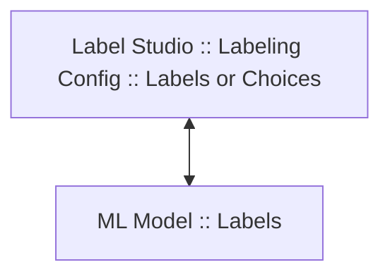

# YOLO ML Backend for Label Studio

This guide describes the simplest way to start using YOLO ML backend with Label Studio.

### How to get YOLO model names?

official docs

## Labeling Config

### How to get YOLO model labels?

Labels are printed in the ML model logs when you start using the ML backend at the INFO logger. 

Or you can find some labels in [YOLO_CLASSES.md](YOLO_CLASSES.md)

### Labels and Choices Mapping



If you use a common YOLO model, you have to make mapping between your labels and ML model labels. 
By default, YOLO ML backend will use the same (or lowercased) names as you specified in `value` attribute. 
In this example your label "Jeep" will be mapped to "jeep" from ML model.

```
<Choices value="Jeep"> 
```

For more precise control you can use `predicted_values` attribute to specify multiple and different labels from ML model:

```
<Choice value="Car" predicted_values="jeep,cab,limousine"/>
```

You can use LLM model (e.g. GPT) to build mapping between Label Studio labels and ML model labels automatically. 
There is an example of such a prompt, it includes 1000 labels from YOLOv8 classification model (`yolov8n-cls`).

```
**Task:**

1. **ML Model Labels:**
   - I have the following labels in my ML model:
['tench', 'goldfish', 'great_white_shark', 'tiger_shark', 'hammerhead', 'electric_ray', 'stingray', 'cock', 'hen', 'ostrich', 'brambling', 'goldfinch', 'house_finch', 'junco', 'indigo_bunting', 'robin', 'bulbul', 'jay', 'magpie', 'chickadee', 'water_ouzel', 'kite', 'bald_eagle', 'vulture', 'great_grey_owl', 'European_fire_salamander', 'common_newt', 'eft', 'spotted_salamander', 'axolotl', 'bullfrog', 'tree_frog', 'tailed_frog', 'loggerhead', 'leatherback_turtle', 'mud_turtle', 'terrapin', 'box_turtle', 'banded_gecko', 'common_iguana', 'American_chameleon', 'whiptail', 'agama', 'frilled_lizard', 'alligator_lizard', 'Gila_monster', 'green_lizard', 'African_chameleon', 'Komodo_dragon', 'African_crocodile', 'American_alligator', 'triceratops', 'thunder_snake', 'ringneck_snake', 'hognose_snake', 'green_snake', 'king_snake', 'garter_snake', 'water_snake', 'vine_snake', 'night_snake', 'boa_constrictor', 'rock_python', 'Indian_cobra', 'green_mamba', 'sea_snake', 'horned_viper', 'diamondback', 'sidewinder', 'trilobite', 'harvestman', 'scorpion', 'black_and_gold_garden_spider', 'barn_spider', 'garden_spider', 'black_widow', 'tarantula', 'wolf_spider', 'tick', 'centipede', 'black_grouse', 'ptarmigan', 'ruffed_grouse', 'prairie_chicken', 'peacock', 'quail', 'partridge', 'African_grey', 'macaw', 'sulphur-crested_cockatoo', 'lorikeet', 'coucal', 'bee_eater', 'hornbill', 'hummingbird', 'jacamar', 'toucan', 'drake', 'red-breasted_merganser', 'goose', 'black_swan', 'tusker', 'echidna', 'platypus', 'wallaby', 'koala', 'wombat', 'jellyfish', 'sea_anemone', 'brain_coral', 'flatworm', 'nematode', 'conch', 'snail', 'slug', 'sea_slug', 'chiton', 'chambered_nautilus', 'Dungeness_crab', 'rock_crab', 'fiddler_crab', 'king_crab', 'American_lobster', 'spiny_lobster', 'crayfish', 'hermit_crab', 'isopod', 'white_stork', 'black_stork', 'spoonbill', 'flamingo', 'little_blue_heron', 'American_egret', 'bittern', 'crane_(bird)', 'limpkin', 'European_gallinule', 'American_coot', 'bustard', 'ruddy_turnstone', 'red-backed_sandpiper', 'redshank', 'dowitcher', 'oystercatcher', 'pelican', 'king_penguin', 'albatross', 'grey_whale', 'killer_whale', 'dugong', 'sea_lion', 'Chihuahua', 'Japanese_spaniel', 'Maltese_dog', 'Pekinese', 'Shih-Tzu', 'Blenheim_spaniel', 'papillon', 'toy_terrier', 'Rhodesian_ridgeback', 'Afghan_hound', 'basset', 'beagle', 'bloodhound', 'bluetick', 'black-and-tan_coonhound', 'Walker_hound', 'English_foxhound', 'redbone', 'borzoi', 'Irish_wolfhound', 'Italian_greyhound', 'whippet', 'Ibizan_hound', 'Norwegian_elkhound', 'otterhound', 'Saluki', 'Scottish_deerhound', 'Weimaraner', 'Staffordshire_bullterrier', 'American_Staffordshire_terrier', 'Bedlington_terrier', 'Border_terrier', 'Kerry_blue_terrier', 'Irish_terrier', 'Norfolk_terrier', 'Norwich_terrier', 'Yorkshire_terrier', 'wire-haired_fox_terrier', 'Lakeland_terrier', 'Sealyham_terrier', 'Airedale', 'cairn', 'Australian_terrier', 'Dandie_Dinmont', 'Boston_bull', 'miniature_schnauzer', 'giant_schnauzer', 'standard_schnauzer', 'Scotch_terrier', 'Tibetan_terrier', 'silky_terrier', 'soft-coated_wheaten_terrier', 'West_Highland_white_terrier', 'Lhasa', 'flat-coated_retriever', 'curly-coated_retriever', 'golden_retriever', 'Labrador_retriever', 'Chesapeake_Bay_retriever', 'German_short-haired_pointer', 'vizsla', 'English_setter', 'Irish_setter', 'Gordon_setter', 'Brittany_spaniel', 'clumber', 'English_springer', 'Welsh_springer_spaniel', 'cocker_spaniel', 'Sussex_spaniel', 'Irish_water_spaniel', 'kuvasz', 'schipperke', 'groenendael', 'malinois', 'briard', 'kelpie', 'komondor', 'Old_English_sheepdog', 'Shetland_sheepdog', 'collie', 'Border_collie', 'Bouvier_des_Flandres', 'Rottweiler', 'German_shepherd', 'Doberman', 'miniature_pinscher', 'Greater_Swiss_Mountain_dog', 'Bernese_mountain_dog', 'Appenzeller', 'EntleBucher', 'boxer', 'bull_mastiff', 'Tibetan_mastiff', 'French_bulldog', 'Great_Dane', 'Saint_Bernard', 'Eskimo_dog', 'malamute', 'Siberian_husky', 'dalmatian', 'affenpinscher', 'basenji', 'pug', 'Leonberg', 'Newfoundland', 'Great_Pyrenees', 'Samoyed', 'Pomeranian', 'chow', 'keeshond', 'Brabancon_griffon', 'Pembroke', 'Cardigan', 'toy_poodle', 'miniature_poodle', 'standard_poodle', 'Mexican_hairless', 'timber_wolf', 'white_wolf', 'red_wolf', 'coyote', 'dingo', 'dhole', 'African_hunting_dog', 'hyena', 'red_fox', 'kit_fox', 'Arctic_fox', 'grey_fox', 'tabby', 'tiger_cat', 'Persian_cat', 'Siamese_cat', 'Egyptian_cat', 'cougar', 'lynx', 'leopard', 'snow_leopard', 'jaguar', 'lion', 'tiger', 'cheetah', 'brown_bear', 'American_black_bear', 'ice_bear', 'sloth_bear', 'mongoose', 'meerkat', 'tiger_beetle', 'ladybug', 'ground_beetle', 'long-horned_beetle', 'leaf_beetle', 'dung_beetle', 'rhinoceros_beetle', 'weevil', 'fly', 'bee', 'ant', 'grasshopper', 'cricket', 'walking_stick', 'cockroach', 'mantis', 'cicada', 'leafhopper', 'lacewing', 'dragonfly', 'damselfly', 'admiral', 'ringlet', 'monarch', 'cabbage_butterfly', 'sulphur_butterfly', 'lycaenid', 'starfish', 'sea_urchin', 'sea_cucumber', 'wood_rabbit', 'hare', 'Angora', 'hamster', 'porcupine', 'fox_squirrel', 'marmot', 'beaver', 'guinea_pig', 'sorrel', 'zebra', 'hog', 'wild_boar', 'warthog', 'hippopotamus', 'ox', 'water_buffalo', 'bison', 'ram', 'bighorn', 'ibex', 'hartebeest', 'impala', 'gazelle', 'Arabian_camel', 'llama', 'weasel', 'mink', 'polecat', 'black-footed_ferret', 'otter', 'skunk', 'badger', 'armadillo', 'three-toed_sloth', 'orangutan', 'gorilla', 'chimpanzee', 'gibbon', 'siamang', 'guenon', 'patas', 'baboon', 'macaque', 'langur', 'colobus', 'proboscis_monkey', 'marmoset', 'capuchin', 'howler_monkey', 'titi', 'spider_monkey', 'squirrel_monkey', 'Madagascar_cat', 'indri', 'Indian_elephant', 'African_elephant', 'lesser_panda', 'giant_panda', 'barracouta', 'eel', 'coho', 'rock_beauty', 'anemone_fish', 'sturgeon', 'gar', 'lionfish', 'puffer', 'abacus', 'abaya', 'academic_gown', 'accordion', 'acoustic_guitar', 'aircraft_carrier', 'airliner', 'airship', 'altar', 'ambulance', 'amphibian', 'analog_clock', 'apiary', 'apron', 'ashcan', 'assault_rifle', 'backpack', 'bakery', 'balance_beam', 'balloon', 'ballpoint', 'Band_Aid', 'banjo', 'bannister', 'barbell', 'barber_chair', 'barbershop', 'barn', 'barometer', 'barrel', 'barrow', 'baseball', 'basketball', 'bassinet', 'bassoon', 'bathing_cap', 'bath_towel', 'bathtub', 'beach_wagon', 'beacon', 'beaker', 'bearskin', 'beer_bottle', 'beer_glass', 'bell_cote', 'bib', 'bicycle-built-for-two', 'bikini', 'binder', 'binoculars', 'birdhouse', 'boathouse', 'bobsled', 'bolo_tie', 'bonnet', 'bookcase', 'bookshop', 'bottlecap', 'bow', 'bow_tie', 'brass', 'brassiere', 'breakwater', 'breastplate', 'broom', 'bucket', 'buckle', 'bulletproof_vest', 'bullet_train', 'butcher_shop', 'cab', 'caldron', 'candle', 'cannon', 'canoe', 'can_opener', 'cardigan', 'car_mirror', 'carousel', "carpenter's_kit", 'carton', 'car_wheel', 'cash_machine', 'cassette', 'cassette_player', 'castle', 'catamaran', 'CD_player', 'cello', 'cellular_telephone', 'chain', 'chainlink_fence', 'chain_mail', 'chain_saw', 'chest', 'chiffonier', 'chime', 'china_cabinet', 'Christmas_stocking', 'church', 'cinema', 'cleaver', 'cliff_dwelling', 'cloak', 'clog', 'cocktail_shaker', 'coffee_mug', 'coffeepot', 'coil', 'combination_lock', 'computer_keyboard', 'confectionery', 'container_ship', 'convertible', 'corkscrew', 'cornet', 'cowboy_boot', 'cowboy_hat', 'cradle', 'crane_(machine)', 'crash_helmet', 'crate', 'crib', 'Crock_Pot', 'croquet_ball', 'crutch', 'cuirass', 'dam', 'desk', 'desktop_computer', 'dial_telephone', 'diaper', 'digital_clock', 'digital_watch', 'dining_table', 'dishrag', 'dishwasher', 'disk_brake', 'dock', 'dogsled', 'dome', 'doormat', 'drilling_platform', 'drum', 'drumstick', 'dumbbell', 'Dutch_oven', 'electric_fan', 'electric_guitar', 'electric_locomotive', 'entertainment_center', 'envelope', 'espresso_maker', 'face_powder', 'feather_boa', 'file', 'fireboat', 'fire_engine', 'fire_screen', 'flagpole', 'flute', 'folding_chair', 'football_helmet', 'forklift', 'fountain', 'fountain_pen', 'four-poster', 'freight_car', 'French_horn', 'frying_pan', 'fur_coat', 'garbage_truck', 'gasmask', 'gas_pump', 'goblet', 'go-kart', 'golf_ball', 'golfcart', 'gondola', 'gong', 'gown', 'grand_piano', 'greenhouse', 'grille', 'grocery_store', 'guillotine', 'hair_slide', 'hair_spray', 'half_track', 'hammer', 'hamper', 'hand_blower', 'hand-held_computer', 'handkerchief', 'hard_disc', 'harmonica', 'harp', 'harvester', 'hatchet', 'holster', 'home_theater', 'honeycomb', 'hook', 'hoopskirt', 'horizontal_bar', 'horse_cart', 'hourglass', 'iPod', 'iron', "jack-o'-lantern", 'jean', 'jeep', 'jersey', 'jigsaw_puzzle', 'jinrikisha', 'joystick', 'kimono', 'knee_pad', 'knot', 'lab_coat', 'ladle', 'lampshade', 'laptop', 'lawn_mower', 'lens_cap', 'letter_opener', 'library', 'lifeboat', 'lighter', 'limousine', 'liner', 'lipstick', 'Loafer', 'lotion', 'loudspeaker', 'loupe', 'lumbermill', 'magnetic_compass', 'mailbag', 'mailbox', 'maillot_(tights)', 'maillot_(tank_suit)', 'manhole_cover', 'maraca', 'marimba', 'mask', 'matchstick', 'maypole', 'maze', 'measuring_cup', 'medicine_chest', 'megalith', 'microphone', 'microwave', 'military_uniform', 'milk_can', 'minibus', 'miniskirt', 'minivan', 'missile', 'mitten', 'mixing_bowl', 'mobile_home', 'Model_T', 'modem', 'monastery', 'monitor', 'moped', 'mortar', 'mortarboard', 'mosque', 'mosquito_net', 'motor_scooter', 'mountain_bike', 'mountain_tent', 'mouse', 'mousetrap', 'moving_van', 'muzzle', 'nail', 'neck_brace', 'necklace', 'nipple', 'notebook', 'obelisk', 'oboe', 'ocarina', 'odometer', 'oil_filter', 'organ', 'oscilloscope', 'overskirt', 'oxcart', 'oxygen_mask', 'packet', 'paddle', 'paddlewheel', 'padlock', 'paintbrush', 'pajama', 'palace', 'panpipe', 'paper_towel', 'parachute', 'parallel_bars', 'park_bench', 'parking_meter', 'passenger_car', 'patio', 'pay-phone', 'pedestal', 'pencil_box', 'pencil_sharpener', 'perfume', 'Petri_dish', 'photocopier', 'pick', 'pickelhaube', 'picket_fence', 'pickup', 'pier', 'piggy_bank', 'pill_bottle', 'pillow', 'ping-pong_ball', 'pinwheel', 'pirate', 'pitcher', 'plane', 'planetarium', 'plastic_bag', 'plate_rack', 'plow', 'plunger', 'Polaroid_camera', 'pole', 'police_van', 'poncho', 'pool_table', 'pop_bottle', 'pot', "potter's_wheel", 'power_drill', 'prayer_rug', 'printer', 'prison', 'projectile', 'projector', 'puck', 'punching_bag', 'purse', 'quill', 'quilt', 'racer', 'racket', 'radiator', 'radio', 'radio_telescope', 'rain_barrel', 'recreational_vehicle', 'reel', 'reflex_camera', 'refrigerator', 'remote_control', 'restaurant', 'revolver', 'rifle', 'rocking_chair', 'rotisserie', 'rubber_eraser', 'rugby_ball', 'rule', 'running_shoe', 'safe', 'safety_pin', 'saltshaker', 'sandal', 'sarong', 'sax', 'scabbard', 'scale', 'school_bus', 'schooner', 'scoreboard', 'screen', 'screw', 'screwdriver', 'seat_belt', 'sewing_machine', 'shield', 'shoe_shop', 'shoji', 'shopping_basket', 'shopping_cart', 'shovel', 'shower_cap', 'shower_curtain', 'ski', 'ski_mask', 'sleeping_bag', 'slide_rule', 'sliding_door', 'slot', 'snorkel', 'snowmobile', 'snowplow', 'soap_dispenser', 'soccer_ball', 'sock', 'solar_dish', 'sombrero', 'soup_bowl', 'space_bar', 'space_heater', 'space_shuttle', 'spatula', 'speedboat', 'spider_web', 'spindle', 'sports_car', 'spotlight', 'stage', 'steam_locomotive', 'steel_arch_bridge', 'steel_drum', 'stethoscope', 'stole', 'stone_wall', 'stopwatch', 'stove', 'strainer', 'streetcar', 'stretcher', 'studio_couch', 'stupa', 'submarine', 'suit', 'sundial', 'sunglass', 'sunglasses', 'sunscreen', 'suspension_bridge', 'swab', 'sweatshirt', 'swimming_trunks', 'swing', 'switch', 'syringe', 'table_lamp', 'tank', 'tape_player', 'teapot', 'teddy', 'television', 'tennis_ball', 'thatch', 'theater_curtain', 'thimble', 'thresher', 'throne', 'tile_roof', 'toaster', 'tobacco_shop', 'toilet_seat', 'torch', 'totem_pole', 'tow_truck', 'toyshop', 'tractor', 'trailer_truck', 'tray', 'trench_coat', 'tricycle', 'trimaran', 'tripod', 'triumphal_arch', 'trolleybus', 'trombone', 'tub', 'turnstile', 'typewriter_keyboard', 'umbrella', 'unicycle', 'upright', 'vacuum', 'vase', 'vault', 'velvet', 'vending_machine', 'vestment', 'viaduct', 'violin', 'volleyball', 'waffle_iron', 'wall_clock', 'wallet', 'wardrobe', 'warplane', 'washbasin', 'washer', 'water_bottle', 'water_jug', 'water_tower', 'whiskey_jug', 'whistle', 'wig', 'window_screen', 'window_shade', 'Windsor_tie', 'wine_bottle', 'wing', 'wok', 'wooden_spoon', 'wool', 'worm_fence', 'wreck', 'yawl', 'yurt', 'web_site', 'comic_book', 'crossword_puzzle', 'street_sign', 'traffic_light', 'book_jacket', 'menu', 'plate', 'guacamole', 'consomme', 'hot_pot', 'trifle', 'ice_cream', 'ice_lolly', 'French_loaf', 'bagel', 'pretzel', 'cheeseburger', 'hotdog', 'mashed_potato', 'head_cabbage', 'broccoli', 'cauliflower', 'zucchini', 'spaghetti_squash', 'acorn_squash', 'butternut_squash', 'cucumber', 'artichoke', 'bell_pepper', 'cardoon', 'mushroom', 'Granny_Smith', 'strawberry', 'orange', 'lemon', 'fig', 'pineapple', 'banana', 'jackfruit', 'custard_apple', 'pomegranate', 'hay', 'carbonara', 'chocolate_sauce', 'dough', 'meat_loaf', 'pizza', 'potpie', 'burrito', 'red_wine', 'espresso', 'cup', 'eggnog', 'alp', 'bubble', 'cliff', 'coral_reef', 'geyser', 'lakeside', 'promontory', 'sandbar', 'seashore', 'valley', 'volcano', 'ballplayer', 'groom', 'scuba_diver', 'rapeseed', 'daisy', "yellow_lady's_slipper", 'corn', 'acorn', 'hip', 'buckeye', 'coral_fungus', 'agaric', 'gyromitra', 'stinkhorn', 'earthstar', 'hen-of-the-woods', 'bolete', 'ear', 'toilet_tissue']

2. **Labeling Config:**
   - I have this labeling config from Label Studio:
   <View>
     <Image name="image" value="$image"/>
     <Choices name="choice" toName="image">
       <Choice value="Car"/>
       <Choice value="Adult content"/>
       <Choice value="Violence"/>
     </Choices>
   </View>

3. **Mapping Instructions:**
   - Map the labels from the Label Studio config to the closest matching ML model labels as follows:
     1. Use the value attribute from each <Choice> tag to identify the label.
     2. Find all similar and relevant labels from the ML model corresponding to each <Choice> label.
     3. Add a predicted_values="<relevant_label1_from_ml_model>,<relevant_label2_from_ml_model>" attribute inside each <Choice> tag using only labels from the ML model.

4. **Output:**
   - Provide the final labeling config with the predicted_values attribute added, using all relevant labels from the ML model, without any explanations.
```

# Video Object Tracking

## Trackers 

The best tracker to use with Ultralytics YOLO depends on your specific needs. The default tracker is BoT-SORT, which is generally well-suited for most scenarios. However, if you're looking for an alternative with different strengths, ByteTrack is another excellent choice that you can easily configure. ByteTrack is known for its high performance in multi-object tracking, especially in situations with varying object appearances and reappearances. Both trackers can be customized using YAML configuration files to fit your specific use case.
You can specify tracker in the control tag: 
* `<VideoRectangle tracker="botsort.yaml">`
* `<VideoRectangle tracker="bytetrack.yaml">`

# Run YOLO ML backend

## Running with Docker (Recommended)

1. Start Machine Learning backend on `http://localhost:9090` with prebuilt image:

```bash
docker-compose up
```

2. Validate that backend is running

```bash
$ curl http://localhost:9090/
{"status":"UP"}
```

3. Connect to the backend from Label Studio running on the same host: go to your project `Settings -> Machine Learning -> Add Model` and specify `http://localhost:9090` as a URL.

## Building from source (Advanced)

To build the ML backend from source, you have to clone the repository and build the Docker image:

```bash
docker-compose build
```

## Running without Docker (Advanced)

To run the ML backend without Docker, you have to clone the repository and install all dependencies using pip:

```bash
python -m venv ml-backend
source ml-backend/bin/activate
pip install -r requirements.txt
```

Then you can start the ML backend:

```bash
label-studio-ml start ./dir_with_your_model
```

# Configuration
Parameters can be set in `docker-compose.yml` before running the container.

The following common parameters are available:
- `BASIC_AUTH_USER` - specify the basic auth user for the model server
- `BASIC_AUTH_PASS` - specify the basic auth password for the model server
- `LOG_LEVEL` - set the log level for the model server
- `WORKERS` - specify the number of workers for the model server
- `THREADS` - specify the number of threads for the model server

# Customization

The ML backend can be customized by adding your own models and logic inside the `./dir_with_your_model` directory. 