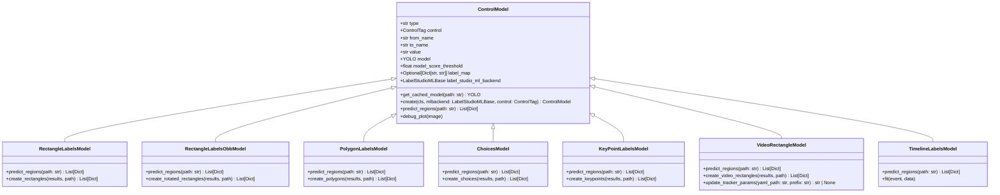

### 1. **Architecture Overview**

The architecture of the project is modular and is primarily centered around integrating YOLO-based models with Label Studio to automate the labeling of images and videos. The system is organized into several Python modules that interact with each other to perform this task. The main components of the architecture include:

1. **Main YOLO Integration Module (`model.py`)**:
   - This is the central module that connects Label Studio with YOLO models. It handles the overall process of detecting control tags from Label Studio’s configuration, running predictions on tasks, and returning the predictions in the format that Label Studio expects.

2. **Control Models (`control_models/`)**:
   - The control models are specialized modules that correspond to different annotation types in Label Studio (e.g., RectangleLabels, PolygonLabels, Choices, VideoRectangle). Each control model is responsible for handling specific types of annotations by using the YOLO model to predict the necessary regions or labels.

3. **Base Control Model (`control_models/base.py`)**:
   - This is an abstract base class that provides common functionality for all control models. It handles tasks like loading the YOLO model, caching it for efficiency, and providing a template for the predict and create methods.

4. **Specific Control Models**:
   - **RectangleLabelsModel (`control_models/rectanglelabels.py`)**: Handles bounding boxes (both simple and oriented bounding boxes) for images.
   - **PolygonLabelsModel (`control_models/polygonlabels.py`)**: Deals with polygon annotations, typically used for segmentation tasks.
   - **ChoicesModel (`control_models/choices.py`)**: Manages classification tasks where the model predicts one or more labels for the entire image.
   - **KeyPointLabelsModel (`control_models/keypointlabels.py`)**: Supports keypoint annotations, where the model predicts the locations of keypoints on an image.
   - **VideoRectangleModel (`control_models/videorectangle.py`)**: Focuses on tracking objects across video frames, generating bounding boxes for each frame.

### 2. **Module Descriptions**

1. **`model.py` (Main YOLO Integration Module)**:
   - **Purpose**: This module serves as the entry point for integrating YOLO models with Label Studio. It is responsible for setting up the YOLO model, detecting which control models are needed based on the Label Studio configuration, running predictions on tasks, and returning the results in the required format.
   - **Key Functions**:
     - `setup()`: Initializes the YOLO model parameters.
     - `detect_control_models()`: Scans the Label Studio configuration to determine which control models to use.
     - `predict()`: Runs predictions on a batch of tasks and formats the results for Label Studio.
     - `fit()`: (Not implemented) Placeholder for updating the model based on new annotations.

2. **`control_models/base.py` (Base Control Model)**:
   - **Purpose**: Provides a common interface and shared functionality for all specific control models. It includes methods for loading and caching the YOLO model, plotting results for debugging, and abstract methods that need to be implemented by subclasses.
   - **Key Functions**:
     - `get_cached_model()`: Retrieves a YOLO model from cache or loads it if not cached.
     - `create()`: Factory method to instantiate a control model.
     - `predict_regions()`: Abstract method to be implemented by subclasses to perform predictions.

3. **`control_models/choices.py` (ChoicesModel)**:
   - **Purpose**: Handles classification tasks where the model predicts one or more labels for an image. It converts the YOLO model’s classification output into Label Studio’s choices format.
   - **Key Functions**:
     - `create_choices()`: Processes the YOLO model’s output and maps it to the Label Studio choices format.

4. **`control_models/rectanglelabels.py` (RectangleLabelsModel)**:
   - **Purpose**: Manages the creation of bounding box annotations, both simple (axis-aligned) and oriented (rotated), from the YOLO model’s output.
   - **Key Functions**:
     - `create_rectangles()`: Converts the YOLO model’s bounding box predictions into Label Studio’s rectangle labels format.
     - `create_rotated_rectangles()`: Handles oriented bounding boxes (OBB) by processing rotation angles and converting them to the required format.

5. **`control_models/polygonlabels.py` (PolygonLabelsModel)**:
   - **Purpose**: Converts segmentation masks generated by the YOLO model into polygon annotations for Label Studio. This is useful for tasks where precise boundaries around objects are required.
   - **Key Functions**:
     - `create_polygons()`: Transforms the YOLO model’s segmentation output into polygon annotations.

6. **`control_models/keypointlabels.py` (KeyPointLabelsModel)**:
   - **Purpose**: Supports keypoint annotations by predicting the locations of keypoints on an image using the pose YOLO model.
   - **Key Functions**:
     - `create_keypoints()`: Processes the YOLO model’s keypoint predictions and converts them into Label Studio’s keypoint labels format.

7. **`control_models/videorectangle.py` (VideoRectangleModel)**:
   - **Purpose**: Focuses on tracking objects across video frames, using YOLO’s tracking capabilities to generate bounding box annotations for each frame in a video sequence.
   - **Key Functions**:
     - `predict_regions()`: Runs YOLO’s tracking model on a video and converts the results into Label Studio’s video rectangle format.
     - `create_video_rectangles()`: Processes the output of the tracking model to create a sequence of bounding boxes across video frames.
     - `update_tracker_params()`: Customizes the tracking parameters based on settings in Label Studio’s configuration.

8. **`control_models/timelinelabels.py` (TimelineLabelsModel)**:
    - **Purpose**: Supports the training of a YOLO model on video data incrementally by updating the model with new annotations as they are submitted.
    - **Key Functions**:
      - `predict_regions()`: Runs YOLO on video frames and returns the predictions.
      - `fit()`: Placeholder method for updating the model with new annotations.

### **Module Interaction**

- **Workflow**: The main workflow begins with `model.py`, which reads tasks and the Label Studio configuration to detect and instantiate the appropriate control models. These control models are responsible for making predictions using the YOLO model and converting the results into a format that Label Studio can use for annotations.
  
- **Inter-Module Communication**: Each control model inherits from `ControlModel` in `base.py`, ensuring that they all share common methods for loading the YOLO model, handling predictions, and caching. The specific control models (e.g., RectangleLabelsModel, PolygonLabelsModel) implement the abstract methods defined in `ControlModel` to provide the specialized behavior needed for different types of annotations.

This modular structure allows for easy extension and modification, where new control models can be added to handle additional annotation types or new model architectures.
