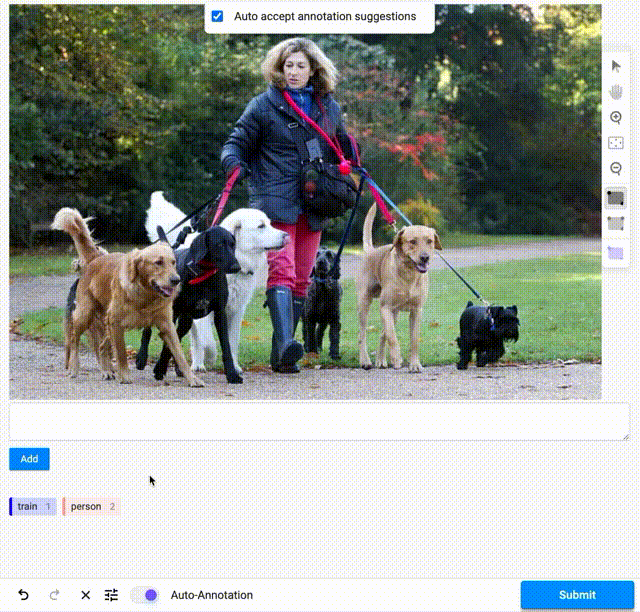

# YOLO-WORLD
This is an example of running YOLO-World as a pre-annotator with prompts. The example shows how to make a backend in case if you are using s3 (minio) storage. 
### Run pre-annotator
```bash
    docker compose up -d
```
Don't forget change default port on available one in docker-compose.yml.

### Configure label studio prompt window in project_name/Settings/Labeling Interface:
```html
<View>
  <Image name="image" value="$image"/>
  <Style>
    .lsf-main-content.lsf-requesting .prompt::before { content: ' loading...'; color: #808080; }
  </Style>
  <View className="prompt">
  <TextArea name="prompt" toName="image" editable="true" rows="2" maxSubmissions="1" showSubmitButton="true"/>
  </View>
  <RectangleLabels name="label" toName="image">
    <Label value="dog" background="blue"/>
    <Label value="cat" background="#FFA39E"/>
  </RectangleLabels>
</View>
```

### Input window example
